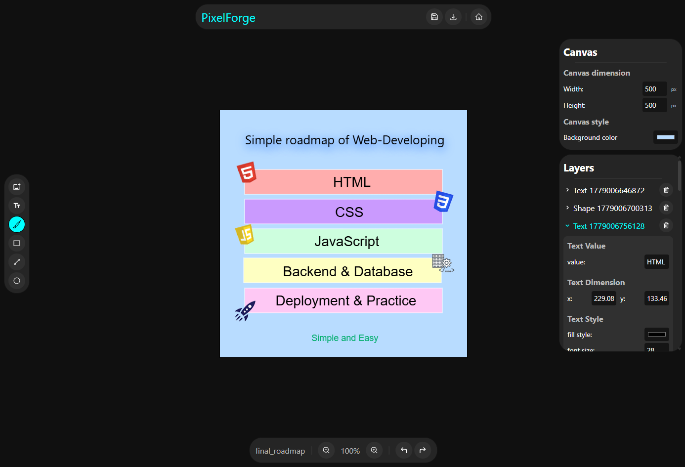
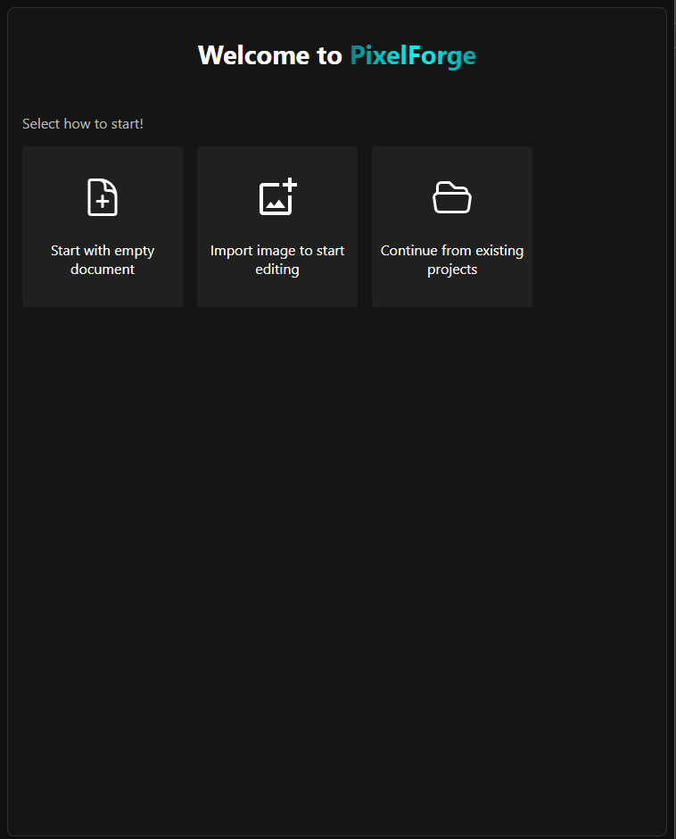
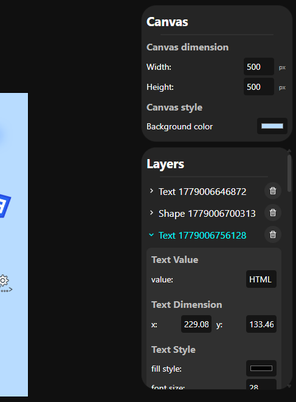
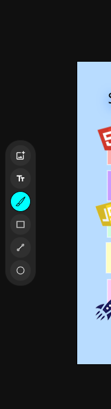
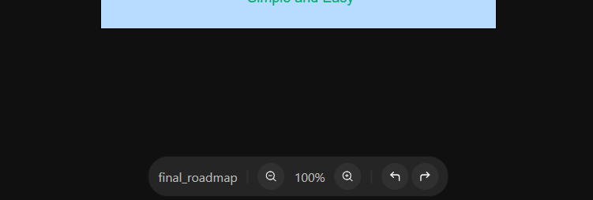

# PixelForge

PixelForge is a browser-based image editor built with React.

This project created as a personal project to learn advanced React state management, canvas manipulation, and editor architecture.
The goal of this project is to provide a light-weight image editing experience directly in the browser while exploring concepts such as layers, Undo/Redo history, project serialization and canvas rendering.

## ✨ Features

### Images

- Add images to canvas
- Resize and reposition images
- Rotate and flip images
- Apply image filters

### Text

- Add editable text
- Change font family
- Change font size
- Change text color
- Apply text shadows

### Shapes

- Rectangle
- Circle
- Line
- Shape styling
- Stroke and shadow customization

### Brush Tool

- Custom brush color
- Custom brush size
- LineCap support
- LineJoin support

### Project Management

- Save projects as JSON
- Open saved projects
- Project naming

### Export

- Export as PNG
- Export as JPEG

### Editor Features

- Layer system
- Undo / Redo
- Zoom controls

## 🚀 Live Demo

https://demo.demo

## 🛠️ Technologies

- React
- Vite
- Canvas API (JS)

## 📸 Screenshots

### Main editor

### Start panel

### Canvas editing & Layers management

### Tools panel

### Status panel

## 🎯 Roadmap

- Keyboard shortcuts
- Gradient support
- Mobile support
- Layer groups
- Selection tool
- SVG support
- Crop tool for canvas
- Crop tool for images
- More shapes support
- Layer system improvements
- ...

## 📄 License

MIT License
